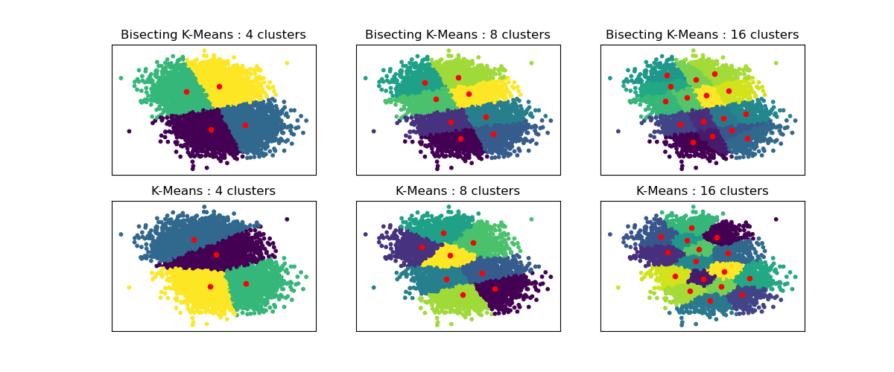

# Bisecting K-Means and Regular K-Means Performance Comparison

## Overview

This Python script compares the performance of Regular K-Means and Bisecting K-Means clustering algorithms using synthetic data. The example demonstrates how these algorithms behave with different numbers of clusters, emphasizing the unique characteristics of Bisecting K-Means in creating clusters with a more regular large-scale structure.

## Dependencies

Make sure you have the required libraries installed before running the script. You can install them using the following:

```bash
pip install matplotlib scikit-learn
```

## Usage

To run the performance comparison, execute the provided Python script:

```bash
python kmeans_comparison.py
```

This will generate a set of subplots visualizing the clustering results for both Regular K-Means and Bisecting K-Means algorithms with varying numbers of clusters.

## Code Explanation

The script uses the `make_blobs` function from scikit-learn to generate synthetic data with two centers. It then compares the clustering results of both Regular K-Means and Bisecting K-Means algorithms for different numbers of clusters (specified in the `n_clusters_list`).

For each algorithm and number of clusters combination, the script plots the data points with cluster assignments and highlights the cluster centers in red. The visualizations provide insights into how the algorithms partition the data.

## Results Interpretation

Observe the differences in clustering behavior between Regular K-Means and Bisecting K-Means. Pay attention to the presence of a dividing line cutting the overall data cloud in two for Bisecting K-Means, which is not present for Regular K-Means.

Feel free to explore and modify the script to suit your needs or use it as a starting point for further analysis.
# Bisecting K-Means and Regular K-Means Performance Comparison



## Description

This example demonstrates the differences between the Regular K-Means algorithm and the Bisecting K-Means algorithm using synthetic data.

While K-Means clusterings vary when increasing `n_clusters`, Bisecting K-Means clustering builds on top of the previous ones. Consequently, it tends to create clusters with a more regular large-scale structure. This difference is visually observable: for all numbers of clusters, there is a dividing line cutting the overall data cloud in two for Bisecting K-Means, which is not present for regular K-Means.

## Clustering Configurations

- **Bisecting K-Means:**
  - 4 clusters
  - 8 clusters
  - 16 clusters

- **Regular K-Means:**
  - 4 clusters
  - 8 clusters
  - 16 clusters

## Contributing

If you find any issues or have suggestions for improvements, please open an issue or submit a pull request. Your contributions are welcome!

## License

This project is licensed under the MIT License - see the [LICENSE](LICENSE) file for details.
