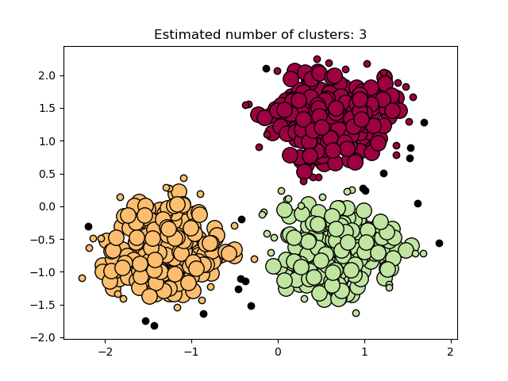

# DBSCAN (Density-Based Spatial Clustering of Applications with Noise)



## Overview

DBSCAN (Density-Based Spatial Clustering of Applications with Noise) is a clustering algorithm designed to identify core samples in regions of high density and expand clusters from them. This algorithm is particularly useful for datasets containing clusters of similar density.

For a demonstration of different clustering algorithms on 2D datasets, refer to the "Comparing different clustering algorithms on toy datasets" example.

## Evaluation Metrics

Clustering algorithms, including DBSCAN, are fundamentally unsupervised learning methods. However, in scenarios where true labels are available, as provided by the `make_blobs` function, evaluation metrics that leverage this "supervised" ground truth information can be used to quantify the quality of resulting clusters. Examples of such metrics include:

- Homogeneity
- Completeness
- V-measure
- Rand-Index
- Adjusted Rand-Index
- Adjusted Mutual Information (AMI)

If ground truth labels are not known, evaluation can be performed using the model results themselves. In such cases, the Silhouette Coefficient is a handy metric.

## Example Usage

To understand the application of DBSCAN and evaluate its performance on synthetic data, refer to the provided example scripts. The associated PNG file (sphx_glr_plot_dbscan_002.png) illustrates the clustering results.

Feel free to explore and modify the examples to suit your specific use case. If you have any questions or improvements, please consider contributing or opening an issue.

## Getting Started

To run the examples, ensure you have the required dependencies installed:

```bash
pip install matplotlib scikit-learn
```

Execute the example script:

```bash
python dbscan_example.py
```

This will generate visualizations and metrics to help you understand the clustering performance of DBSCAN.

## Contributing

Contributions are welcome! If you encounter issues or have suggestions for improvements, please open an issue or submit a pull request. Your insights can help enhance the usability and effectiveness of the DBSCAN algorithm for the community.

## License

This project is licensed under the MIT License - see the [LICENSE](LICENSE) file for details.